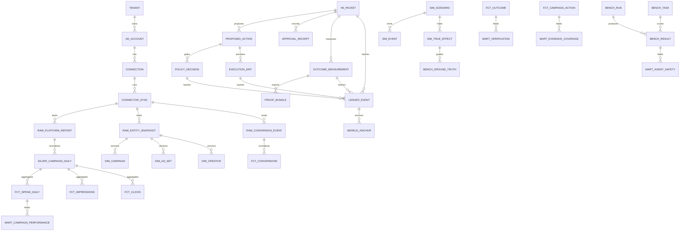

# AdMatix Live Data Evidence Architecture

Status: implementation roadmap and schema bridge
Last updated: 2026-05-24

This document defines how AdMatix should move from the current proof package to
live/customer pilots without confusing static proof artifacts, simulator
calibration, prediction benchmarks, and true incrementality evidence.

## Executive Position

AdMatix is ready to show investors as an honest artifact-backed proof, not as a
continuous live advertising dashboard.

The public proof surface should say exactly this:

- `/` and `/artifacts` are accepted proof artifacts from CX-2 validation, CX-3
  head-to-head benchmarks, and CX-4 public RCT/backtest gates.
- `/overview`, `/worlds`, `/benchmark`, `/validation`, and `/decisions` are
  Demo Lab routes. They are useful for explaining the product, but they are not
  proof of live paid-media lift.
- Future live data should be promoted into immutable proof bundles only after
  H0, policy, experiment, measurement, and claim-limit checks pass.

## Evidence Hierarchy

| Tier | Evidence type | AdMatix interpretation | Product use |
| --- | --- | --- | --- |
| 1 | Pre-registered randomized holdout or geo experiment with first-party revenue | Strongest proof of incrementality in the measured scope | Required for a live spend-lift claim |
| 2 | Public randomized/backtest datasets, currently Hillstrom and Criteo Uplift | Strong evidence that the verifier and measurement code recover aggregate effects on known datasets | Proof package and regression gates |
| 3 | Seeded simulator worlds with hidden known truth | Calibration and stress testing, not real-world proof | Verifier development, robustness, demo repeatability |
| 4 | Synthetic control, BSTS, MMM, CATE, and OPE | Useful under explicit assumptions and diagnostics | Directional decisions, triangulation, and abstention logic |
| 5 | CTR, CVR, recommender, attribution, and platform ROAS | Prediction and optimization signals, not causal proof | Simulator realism, targeting hypotheses, and agent scoring |

The H0 gate should default to "inconclusive" when the design cannot support the
claim. A confident wrong claim is worse than an abstention.

## H0 Packet Doctrine

Every spend-touching proposal must carry:

- Null hypothesis and alternative.
- Treatment definition, unit of assignment, and target population.
- Primary metric, guardrail metrics, baseline window, measurement window, and
  cooldown window when needed.
- Power/MDE, alpha, decision rule, and expected claim limit.
- Rollback checkpoint and max-risk envelope.
- Evidence references and data freshness.
- Named confounders and assumptions.

The verifier returns an estimate, confidence interval, method, verdict,
confounders, guardrail proof, and claim limit. It must never turn a weak design
into a rigorous per-decision causal claim.

## Method Roadmap

| Lane | Add when | Methods | Primary diagnostics | Claim boundary |
| --- | --- | --- | --- | --- |
| Geo/RCT | First live pilot | Matched geo holdout, platform lift test, switchback when suitable | MDE, power, pre-period fit, placebo tests, CI, lower-bound iROAS | Incrementality only for the pre-registered scope |
| OPE | Logged policies include propensities | IPS, SNIPS, doubly robust, effective sample size | Propensity coverage, clipping sensitivity, ESS, policy overlap | Logged-policy evaluation, not free causal lift |
| Programmatic | RTB/bidding work begins | iPinYou, AuctionGym, pacing simulators | Win rate, pacing error, regret, unsafe bid changes, cap violations | Auction behavior and safety, not incrementality |
| Prediction | Simulator realism needs more behavioral data | Criteo CTR, Avazu, Taobao, Amazon Reviews, Criteo Attribution | Log loss, AUC, calibration, leakage checks, source license | Targeting and propensity realism only |
| Creative/policy | Copy and brand safety enter scope | Brand-safety and ad-copy datasets, policy classifiers | False accepts, unsafe claims, hallucinated platform fields | Compliance and quality control |
| Agent analytics | Agent task scoring matures | AD-Bench style trajectory evaluation | Task success, tool coverage, evidence citation, unsafe recommendation rate | Agent competence, not causal measurement |

AD-Bench belongs in `bench` as an agent-evaluation lane. It should grade task
success, trajectory coverage, evidence citation quality, and unsafe
recommendations. It does not replace the verifier or the H0 gate.

LightAnchor-style source mapping belongs in data operations: ingestion,
reconciliation, schema mapping, data quality, and provenance. It is useful for
trustworthy pipelines, but it is not an incrementality standard by itself.

## Dataset And Source Plan

| Priority | Source | Use | Causal proof? | Notes |
| --- | --- | --- | --- | --- |
| Keep | Criteo Uplift v2.1 | Uplift/backtest gate | Strong public RCT-style evidence | Already part of CX-4 artifacts |
| Keep | Hillstrom | Email campaign RCT/backtest gate | Strong public RCT evidence | Already part of CX-4 artifacts |
| Keep | Simulator truth | Calibration and robustness | No, simulated only | Required for verifier regression |
| Add next | Open Bandit Dataset / OBP | OPE with propensities | Only under OPE assumptions | Track overlap and ESS |
| Add next | Google Analytics ecommerce sample | Reporting/reconciliation demo | No | Useful for dashboard and warehouse examples |
| Add next | Brand-safety/ad-copy datasets | Creative and policy lane | No | Use for false-accept safety tests |
| Add next | Criteo Attribution slice | Attribution modeling and leakage checks | Weak by itself | Good for feature realism |
| Add later | Criteo CTR, Avazu, Taobao, Amazon Reviews | Prediction and recommender realism | No | Large data; add only with license/provenance tracking |
| Customer path | Google Ads, GA4/BigQuery, Shopify/Stripe, Meta, TikTok, Amazon Ads | Live pilots | Only if paired with holdout or geo design | Start with read-only CSV exports before OAuth writes |

For every source, store source URL, license, commercial-use flag,
redistribution limits, date accessed, raw checksum, row count, schema version,
freshness, and whether it can support causal claims.

## Live Data Model

The live data architecture is a shadow-mode evidence pipeline, not a raw latest
dashboard. Raw connector data lands losslessly, normalized facts feed
measurement, and public dashboard data is promoted only as a proof bundle.

`warehouse/migrations/0005_live_data_readiness.sql` adds the missing bridge
tables:

- `app.connector_syncs`: provenance, freshness, row counts, checksum, API
  version, and cursor lineage for read-only platform imports.
- `warehouse.raw_platform_reports`: daily metric rows from ad platforms.
- `warehouse.raw_entity_snapshots`: campaign, ad set, ad, creative, keyword,
  audience, budget, and conversion-action snapshots for SCD history and
  rollback.
- `warehouse.raw_conversion_events`: first-party conversion/order events with
  privacy-safe IDs and gross margin/revenue.
- `app.experiment_designs`: pre-registered measurement designs with power/MDE,
  randomization seed, windows, placebo plan, assumptions, and decision rule.
- `app.proof_bundles`: immutable dashboard/export payloads with source tables,
  source commits, evidence freshness, checksums, claim limits, and origin kind.

## KPI Taxonomy

| Area | Standard columns |
| --- | --- |
| Delivery | spend, impressions, reach, frequency, clicks, outbound clicks, CTR, CPM, CPC, video views, viewability, engagements |
| Conversion | conversion action, conversions, conversion value, revenue, gross margin, CVR, CPA, CAC, CPL, ROAS, MER, AOV, new-customer flag, LTV proxy |
| Auction/programmatic | bid requests, bids, wins, win rate, bid price, clearing price, eCPM, deal ID, placement, publisher, IVT/fraud, pacing error |
| Experiment | treatment arm, unit key, geo, pre/post period, baseline, observed, incremental conversions/revenue, lift percent, CI, p-value or credible interval, MDE, power, placebo result |
| Governance | H0 packet ID, proposed action ID, policy result, approval, rollback checkpoint, ledger hash, proof bundle ID, claim limit |

## Self-Owned Live Pilot

Start with an owned low-risk product/app/landing page. Agents propose, AdMatix
gates, and humans apply changes.

1. Shadow replay: freeze account snapshots and give Synter, generic Claude,
   generic Codex, and AdMatix the same task. Compare recommendations without
   changing spend. This is agent-quality evidence only; it is not causal pilot
   evidence.
2. Pre-register: create an `app.experiment_designs` row before any live
   measurement.
3. Primary H0: AdMatix-gated policy does not improve incremental revenue or
   iROAS versus a pre-registered control arm: status-quo policy, matched
   control geos, an in-platform lift-test control, or a switchback control.
4. Primary metric: first-party incremental gross margin or revenue, not platform
   ROAS.
5. Design: matched geo holdout if volume allows, otherwise platform lift test or
   switchback. Underpowered tests must be labelled underpowered.
6. Success rule: CI excludes zero and lower-bound iROAS clears break-even.
   Otherwise report inconclusive.
7. Safety: max daily budget delta, budget cap, no unapproved creative launch, no
   policy-sensitive targeting, and rollback checkpoint before every applied
   change.

## Dashboard Rules

- Root `/` and `/artifacts` render `origin.kind = "artifact"` proof only.
- Demo Lab routes remain `origin.kind = "demo"` or similarly labelled
  illustrative data.
- No route may call static demo data "live".
- New live/customer proof should be generated into `app.proof_bundles`, exported
  to `docs/proof/artifacts`, and then deployed to the dashboard as a validated
  artifact.
- Public copy must preserve this boundary: calibrated simulator plus public
  RCT/backtest evidence supports evidence-gated verification behavior, but does
  not prove live paid-media lift.

## References

- Google Research, "Measuring Ad Effectiveness Using Geo Experiments":
  https://research.google/pubs/pub38355
- Google Ads Help, geo Conversion Lift metrics:
  https://support.google.com/google-ads/answer/14102986
- Meta GeoLift methodology:
  https://facebookincubator.github.io/GeoLift/docs/Methodology/
- IAB, Guidelines for Incremental Measurement in Commerce Media:
  https://www.iab.com/guidelines/guidelines-for-incremental-measurement-in-commerce-media/
- Google Meridian model-fit diagnostics:
  https://developers.google.com/meridian/docs/advanced-modeling/model-fit
- Open Bandit Pipeline:
  https://zr-obp.readthedocs.io/en/latest/index.html
- AuctionGym:
  https://github.com/amazon-science/auction-gym
- Criteo Uplift on Hugging Face:
  https://huggingface.co/datasets/criteo/criteo-uplift
- AD-Bench paper page:
  https://huggingface.co/papers/2602.14257
- IAB Tech Lab AAMP:
  https://iabtechlab.com/standards/aamp-agentic-advertising-management-protocols/
- Ad Context Protocol:
  https://docs.adcontextprotocol.org/docs/intro
