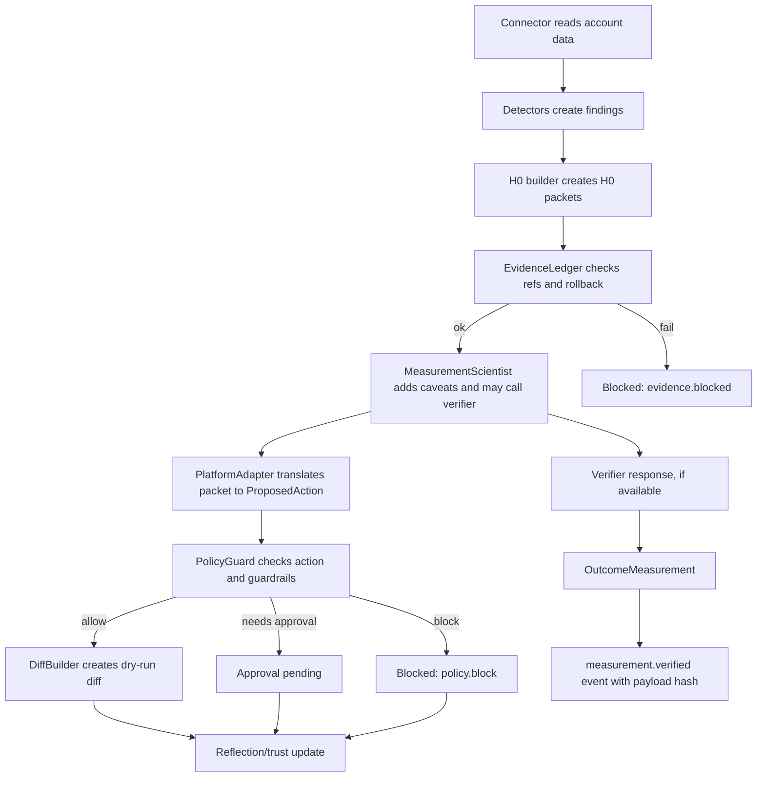

# AdMatix H0 Gate, Hypothesis Testing, Prediction, Evaluation, and Measurement Deep Dive

Status: technical deep dive
Snapshot: `main` at `38f018c` before this report commit
Audience: founders, engineers, reviewers, and future proof-package agents
Last updated: 2026-05-24

## Executive Summary

AdMatix is built around one discipline: an AI agent can propose paid-media
changes, but it cannot directly convert its own recommendation into a trusted
spend-changing action. Every spend-touching decision is wrapped in an H0 packet,
checked by deterministic gates, optionally measured by an independent verifier,
and recorded with a reproducible evidence trail.

There are two related but distinct ideas:

1. The operational H0 gate: the product control path that requires a packet,
   evidence refs, rollback, guardrails, policy checks, approval state, and dry-run
   diffs before an action can move forward.
2. The statistical H0 test: the verifier's quantitative question, usually
   "is the incremental effect distinguishable from zero under the evidence
   design we have?"

The system deliberately does not say "the agent was right" just because a metric
went up. It separates platform-reported directionality from causal evidence. In
low-evidence cases, the correct output is `inconclusive`.

Current proof status:

- Product H0 packets and dry-run gates pass the demo/e2e path.
- The independent verifier returns estimate, confidence interval, method,
  verdict, confounders, diagnostics, and deterministic guardrail proof.
- Validation passes SBC, empirical CI coverage, RMSE/bias, multiseed variance,
  placebo false-positive, head-to-head, and public RCT/backtest gates.
- The honest claim remains: calibrated simulator plus public RCT/backtest
  evidence supports evidence-gated verification behavior. It does not prove live
  spend lift.

## Core Terms

| Term | Meaning in AdMatix |
| --- | --- |
| H0 packet | The canonical decision packet that states the proposed action, null hypothesis, success metric, guardrails, evidence refs, rollback, approval state, and trace metadata. |
| Null hypothesis | The skeptical claim: the intervention does not improve the goal metric relative to an appropriate counterfactual. |
| Alternative hypothesis | The action's intended improvement, such as positive incremental lift, lower wasted spend, or preserved conversion volume under guardrails. |
| EvidenceRef | A pointer to a concrete source row or system-generated proof reference, optionally with a source-row hash. |
| EvidenceLedger | Deterministic provenance gate. It checks evidence structure, ref patterns, row existence, and optional hash equality. |
| PolicyGuard | Deterministic action-safety gate. It blocks non-dry-run writes, budget-cap breaches, malformed actions, missing guardrails, and unknown policy kinds. |
| Verifier | Independent FastAPI/Python service. It estimates incremental effect when evidence supports it and returns uncertainty plus diagnostics. |
| OutcomeMeasurement | Persisted measurement row that maps the verifier response into the frozen TypeScript schema. |
| Causal status | The strength of the claim. Detectors start at `directional_until_lift_test`; verifier outputs can be `experimental` or `inconclusive`, but product packets do not become live causal proof by default. |
| Verdict | The verifier's decision label: `lift_detected`, `no_effect`, or `inconclusive`. |

## System Map



Important boundary: the verifier is not the acting agent. It cannot create a
`ProposedAction`, cannot approve an H0 packet, and cannot bypass EvidenceLedger
or PolicyGuard. It only measures and annotates.

## The H0 Packet Contract

The H0 packet is the unit of trust in the TypeScript product layer. It is defined
in `packages/schemas/src/h0-packet.ts`.

Required fields:

| Field | Purpose |
| --- | --- |
| `packet_id` | Stable packet identity. |
| `tenant_id` | Tenant boundary. |
| `goal` | Business goal supplied by the operator or workflow. |
| `hypothesis` | The positive/action claim. |
| `null_hypothesis` | The skeptical no-improvement/counterfactual claim. |
| `baseline_window` | Window used to form the baseline. |
| `success_metric` | Metric used for the measurement question. |
| `guardrails` | Budget/MER/CAC/approval safety constraints. |
| `evidence` | Non-empty array of `EvidenceRef`. |
| `causal_status` | Claim-strength label. MVP detector packets begin as directional. |
| `proposal` | Action name, target entity, params, and `dry_run_only`. |
| `rollback` | Method and checkpoint id required before activation. |
| `approval` | Pending/approved/rejected/not-required state. |
| `created_by_agent` | Agent provenance. |
| `created_at` | Timestamp. |
| `trace_id` | Cross-system trace correlation. |

Schema invariants:

- `evidence` must contain at least one ref.
- `rollback` must exist.
- `proposal.dry_run_only` defaults to true.
- Causal claims are constrained to the declared enum.

The current builder lives in `packages/evidence/src/h0-builder.ts`. It emits
packets only for high/medium severity findings and defaults every detector
finding to `directional_until_lift_test`. That is intentional: platform metrics
can identify suspicious waste or likely improvement, but they are not causal
proof.

Example H0 shape in words:

- Hypothesis: reducing spend on a wasteful campaign will lower wasted spend
  while conversion volume remains inside guardrails.
- Null: no intervention improves the goal; observed metrics could revert or be
  explained without the action.
- Guardrails: daily budget delta cap, minimum MER, and human approval.
- Proposal: a dry-run budget shift, usually with `delta_pct`.
- Evidence: campaign daily rows, campaign summaries, or system refs.
- Rollback: restore previous budget or equivalent checkpoint.

## What "H0 Gate" Means Operationally

The operational gate is not one function. It is a chain of fail-closed checks.

### Gate 1: EvidenceLedger

EvidenceLedger answers: "Is this packet allowed to be considered at all?"

It checks:

- The subject is an object.
- Evidence exists and each ref has `source` and `ref`.
- H0 packets include rollback method and checkpoint id.
- Ref patterns match known forms, such as:
  - `metric:campaign_daily:<account>:<campaign>:<date>`
  - `metric:campaign_summary:<account>:<campaign>`
  - `campaign:<account>:<campaign>`
  - `trust:<subject_type>:<subject_id>`
  - `action:<action_id>`
  - `packet:<packet_id>`
  - `policy:<rule_id>:<version>`
- With a resolver, each metric/campaign ref resolves to a concrete row.
- If a ref hash is supplied, the resolved row hash must match.

Failure mode:

- Missing evidence, malformed refs, unresolved rows, or hash mismatch return
  `ok:false`.
- The workflow emits `evidence.blocked`.
- No action translation or diff is trusted for that packet.

Engineering meaning:

EvidenceLedger prevents "the agent said so" from being evidence. The packet
must point to real rows or system proofs.

### Gate 2: MeasurementScientist Caveat Gate

MeasurementScientist answers: "What claim strength is allowed before the action
path continues?"

It:

- Downgrades any packet claim back to `directional_until_lift_test` in the MVP
  product packet path.
- Adds low-volume caveats, such as low conversion sample size.
- Optionally calls the independent verifier when `verifierClient` and a
  post-period data URI are supplied.
- Adds verifier method, verdict, causal status, and confounders as caveats.

Failure mode:

- If verifier is unavailable, it appends `verifier_unavailable:<reason>`.
- The workflow continues, but there is no verification measurement for that
  packet.
- The verifier outage cannot weaken the policy/evidence gates.

Engineering meaning:

The measurement agent is a claim limiter. It is not an approver.

### Gate 3: PolicyGuard

PolicyGuard answers: "Even if the packet is evidence-backed, is this action
safe under deterministic policy?"

It checks:

- The action parses as a `ProposedAction`.
- The context includes valid guardrails.
- The action is dry-run only.
- Budget shifts have numeric `params.delta_pct`.
- Absolute budget delta does not exceed the cap.
- Spend-touching actions require approval.
- New/unknown policy kinds fail closed through exhaustiveness checks.

Results:

- `block`: action cannot proceed.
- `needs_approval`: action is spend-touching and needs human approval before
  activation.
- `allow`: safe path may continue to a dry-run diff.

Engineering meaning:

PolicyGuard is independent of causal lift. A campaign can have true positive
lift and still be blocked if it violates budget or approval policy.

### Gate 4: Approval and Dry-Run Diff

ApprovalCoordinator and DiffBuilder answer:

- Has the action reached the right approval state?
- Can we show the exact platform mutation without performing it?

Current system behavior:

- `runWorkflow` stops at `needs_approval` and emits `approval.pending`.
- `runActivation` requires a verified approval receipt before building a diff.
- Diffs are dry-run only and contain field-level before/after changes.
- The system does not mutate a live ad platform in the proof package.

### Gate 5: Measurement Persistence and Ledger Hash

If a verifier response exists, the orchestrator maps it into
`OutcomeMeasurement`:

| Verifier field | OutcomeMeasurement mapping |
| --- | --- |
| `estimate` | `observed_value` and `delta_pct` |
| `ci_low`, `ci_high` | `confidence_interval` |
| `method` | `notes["method:<name>"]` |
| `verdict` | `notes["verdict:<name>"]` and `passed` |
| `causal_status` | `notes["causal_status:<name>"]` |
| `confounders[]` | `notes["confounder:<name>"]` |
| `tx_id` | `notes["tx_id:<tx_id>"]` |

The workflow also emits `measurement.verified` with the SHA-256 hash of the
canonical verifier payload. The evidence ref on the measurement carries the
same hash. This lets reviewers connect:

- Verifier response
- OutcomeMeasurement row
- Event stream hash
- Future ledger hash-chain records

## The Statistical Hypothesis Test

The statistical H0 is separate from the operational packet gate.

In most verifier paths:

- H0: the incremental effect is not positive relative to the relevant
  counterfactual. Equivalently, the effect is zero or cannot be distinguished
  from zero under the available evidence.
- H1: the incremental effect is positive and detectable under the current
  design.

The verifier does not return a naked causal number. It returns:

- `estimate`
- `ci_low`
- `ci_high`
- `ci_level`
- `method`
- `causal_status`
- `verdict`
- `confounders`
- `diagnostics`
- `rejected_methods`
- `guardrail_proof`
- `packet_id`
- `tx_id`

### Verdict Logic

For quantitative methods, the basic decision rule is:

| Interval condition | Verdict | Meaning |
| --- | --- | --- |
| `ci_low > 0` | `lift_detected` | Evidence supports positive incremental lift under this design. |
| `ci_high < 0` | `no_effect` | Evidence indicates non-positive or harmful effect under this design. |
| interval spans zero | `inconclusive` | Do not claim lift; evidence is not decisive. |

Important nuance: `no_effect` is an operational label, not a philosophical proof
that the true effect is exactly zero. It means the verifier saw a confidently
non-positive effect for the current measurement setup.

### Causal Status Logic

The verifier's method result usually sets:

- `experimental` when lift is detected by a supported design.
- `inconclusive` when evidence is missing, underpowered, degenerate, or spans
  zero.

The product packet itself remains conservative in the MVP: MeasurementScientist
does not upgrade the H0 packet into a live causal claim. It records verifier
evidence alongside the packet instead.

## The Independent Verifier

The verifier is implemented in `services/verifier`. The FastAPI surface is:

- `GET /healthz`
- `POST /simulate`
- `POST /verify`

`/verify` loads events, loads optional metadata, always runs guardrail proof,
selects the strongest applicable quantitative method, dispatches to that method,
and returns the canonical response.

### Method Selection Ladder

Selection happens in `services/verifier/src/admatix_verifier/select.py`.

| Priority | Evidence shape | Method |
| --- | --- | --- |
| 1 | `logging_propensity` present | `ope_ips_snips_dr` |
| 2 | valid geo pre/post holdout, or `hint.design == "geo_holdout"` and contract holds | `geo_synthetic_control` |
| 3 | user-level rows with treatment, outcome, and covariates | `cate_meta_learner` |
| 4 | aggregate period/outcome time series | `bsts_synthetic_control` |
| 5 | no quantitative evidence design | `guardrail_only` |

The response includes rejected methods and reasons, so reviewers can see why a
stronger method was not used.

### Layer A: Deterministic Guardrail Proof

Implemented in `methods/guardrail.py`.

This layer always runs. It evaluates declared guardrails against the action log.
Rules include:

- `budget_cap`: total spend <= limit
- `freq_cap`: max frequency <= limit
- `pacing_min`: min pacing >= limit
- `pacing_max`: max pacing <= limit
- `geo_allowlist`: all geos in allowlist
- `audience_allowlist`: all audiences in allowlist

Unknown guardrail keys produce a failing rule row with
`predicate="unknown_rule"`. This avoids silent proof gaps.

Output:

```json
{
  "all_pass": true,
  "rules": [
    {
      "rule_id": "budget_cap",
      "predicate": "total_spend<=limit",
      "inputs": { "limit": 50000, "total_spend": 48210 },
      "pass": true
    }
  ]
}
```

### Layer B: BSTS / Synthetic Control

Implemented in `methods/bsts.py`.

Used when the evidence is time-series shaped. It aggregates treated and control
conversion rates by period, fits a statsmodels local-level state-space model on
the pre-period, forecasts the counterfactual post-period, and estimates the
mean post-period gap.

Key design choices:

- First half of timeline is pre-period; second half is post-period.
- Treated series is modeled with control series as exogenous covariate.
- Forecast uncertainty is not treated as independent per step. The method draws
  posterior-predictive trajectories and uses the standard deviation of their
  post-period means as the standard error of the average gap.

Confounders named:

- `seasonality`
- `control_rate`

Main failure/abstention case:

- Too few periods returns `inconclusive`.

### Layer C: CATE Meta-Learner

Implemented in `methods/cate.py`.

Used when rows contain user-level treatment, outcome, and covariates. The
primary backend is `econml.dml.LinearDML` with gradient-boosting nuisance
models. If that fails, it falls back to `causalml` T-learner with bootstrap CI.

Covariates:

- Numeric: `recency`, `frequency`, `prior_conversions`
- Categorical: `device`, `age_band`

Outputs:

- ATE estimate
- 95% interval, finite-sample inflated
- Qini diagnostic
- Backend used
- Covariate list as named confounders

Why interval inflation exists:

Phase 4 calibration found finite-sample undercoverage from raw asymptotic DML
intervals. The verifier records a deterministic conservative interval inflation
instead of overclaiming precision.

Verdict:

- `ci_low > 0`: `lift_detected`
- `ci_high < 0`: `no_effect`
- otherwise: `inconclusive`

### Layer D: Geo Pre/Post Holdout

Implemented in `methods/geo.py`.

Used when treatment varies by geo and post-period:

- `geo_id`
- `period`
- `outcome`
- `treatment`
- `treated_geo`
- `post_period`

The estimand is the interaction:

```text
treated_geo * post_period
```

This matters because a geo label alone is not a causal treatment when geos have
fixed baseline differences. The repaired simulator emits true pre/post geo
holdouts: treated geos are untreated before intervention and treated after;
control geos are never treated.

The verifier:

- Aggregates to a geo-period panel.
- Builds a weighted least-squares DiD model.
- Includes geo fixed effects.
- Includes period fixed effects.
- Clusters uncertainty by geo when possible.
- Inflates finite-sample intervals.
- Computes MDE and power.

If the plausible lift is below MDE, the method returns `inconclusive` with an
underpowered diagnostic rather than spending credibility on a weak estimate.

Confounders named:

- `geo_baseline`
- `seasonality`

### Layer E: Off-Policy Evaluation

Implemented in `methods/ope.py`.

Used when logged propensities exist. This estimates the value of a new policy
against a logging policy.

Input requirements:

- `logging_propensity`
- `outcome`
- optional `new_policy_propensity`
- optional `treatment`

Estimators:

- IPS
- SNIPS
- Doubly robust

The verifier uses SNIPS as the primary returned estimate and includes all
estimators in diagnostics.

Safety checks:

- Effective sample size threshold.
- Extreme weight fraction threshold.
- Weight clipping.

If weights are degenerate, the result is `inconclusive`.

## Prediction vs Verification

AdMatix uses "prediction" in three very different ways. Keeping them separate is
central to the product's honesty.

### 1. Detector Prediction

The TypeScript detectors look at platform/first-party metrics and predict that
an account area is suspicious:

- budget waste
- pacing issue
- creative fatigue
- supply path quality problem
- tracking issue

These predictions create findings and H0 packets. They are directional and
operational. They are not causal proof.

Output claim strength:

```text
directional_until_lift_test
```

### 2. Buyer/Agent Prediction

In benchmarks, policy and LLM buyers read reported snapshots and propose
actions. They do not see hidden ground truth. This tests whether an operator
plus AdMatix gate behaves better than the operator alone.

The buyer can propose a scale-up, hold, pause, or budget change. The AdMatix
gate checks scale-ups with the real verifier before applying them in simulation.

This is where the H0 gate becomes a pre-action scale-up gate in the benchmark:

- no-AdMatix arms pass the buyer's action through.
- AdMatix arms build an H0 subset and call the verifier.
- `lift_detected` allows scale-up.
- `inconclusive` rewrites scale-up to hold.
- `no_effect` rewrites scale-up to pause/cut.

### 3. Verifier Estimation

The verifier is not making a buyer recommendation. It estimates a causal or
counterfactual quantity under the evidence design. Its output is an estimate
with uncertainty and diagnostics.

The verifier may say:

- "There is enough evidence to call positive lift."
- "There is enough evidence to call non-positive effect."
- "There is not enough evidence; do not claim lift."

That last case is not a failure. It is the product doing the right thing.

## Simulator Ground Truth

The simulator lives in `services/simulator`. It produces ad-campaign worlds
where the true incremental effect is known by construction.

Each simulated row includes:

- `user_id`
- `period`
- `geo_id`
- `age_band`
- `device`
- `recency`
- `frequency`
- `prior_conversions`
- `baseline_propensity`
- `treated_propensity`
- `treatment`
- `treated_geo`
- `post_period`
- `competing_load`
- `outcome`
- `revenue`
- `tau`

Ground truth metadata includes:

- `ate`
- `att`
- `verification_target_ate`
- `true_incremental_lift`
- `seed`
- `baseline_cr`
- `seasonality_curve`
- `geo_count`
- `geo_holdout` metadata
- confounder coefficients
- outcome model formula
- assignment model rule
- non-stationary parameters
- cross-campaign interference parameters
- adversarial/misspecification parameters
- seed-paired counterfactual difference

### World Types

| World | Purpose | Expected verifier behavior |
| --- | --- | --- |
| `clean_ab` | Randomized user-level assignment. | Recover truth with CATE/clean estimates. |
| `geo_structured` | Geo pre/post holdout. | Use geo DiD/synthetic-control path; flag underpowered worlds. |
| `confounded` | Observed covariates affect assignment and outcome. | Adjust for covariates; naive difference should be biased. |
| `zero_lift_placebo` | True lift exactly zero under confounding/noise. | Do not manufacture lift; false-positive rate <= threshold. |
| `non_stationary` | Effect decay and learning-phase drift. | Avoid confident wrong claims in hard cases. |
| `cross_campaign_interference` | Competing campaigns dilute focal lift. | Report limits; avoid overclaiming. |
| `adversarial_misspecified` | Hidden confounder, heavy-tailed noise, time-varying confounding, spillover. | Robustness report, not forced lift recovery; confident wrong claim fails. |

### Estimands

The simulator tracks more than one truth because "the effect" depends on the
measurement question.

| Estimand | Meaning |
| --- | --- |
| ATE | Mean per-row treatment effect across the population. |
| ATT | Mean treatment effect among treated rows. |
| `verification_target_ate` | Verifier-facing target. For geo worlds this uses the post-period action estimand rather than diluted whole-panel ATE. |
| Seed-paired counterfactual difference | Mean treated propensity minus mean baseline propensity using same seeded world. |

Why `verification_target_ate` matters:

Geo pre/post verification estimates the post-intervention geo effect. Comparing
that estimate to a full-panel average that includes pre-period zero treatment
would incorrectly make the verifier look biased. The repaired validation harness
uses the right target.

## Evaluation Harness

The validation harness lives in `services/validation`. It exists to test whether
the verifier is calibrated, not merely whether it returns pretty JSON.

CLI:

```bash
python -m admatix_validation sbc       --config services/validation/configs/sbc-default.json
python -m admatix_validation coverage  --config services/validation/configs/coverage-default.json
python -m admatix_validation rmse-bias --config services/validation/configs/rmse-default.json
python -m admatix_validation multiseed --config services/validation/configs/multiseed-default.json
python -m admatix_validation all       --config services/validation/configs/phase4-gate.json
```

The `all` gate exits 0 only when:

- SBC rank uniformity passes.
- CI coverage passes.
- RMSE and bias both pass.
- Multiseed variance and false-positive gates pass.

### SBC

Simulation-Based Calibration checks whether Bayesian inference behaves as
expected under the reference model.

Procedure:

1. Draw true parameter from the prior.
2. Simulate data from the same model.
3. Fit the PyMC reference model.
4. Rank the true parameter within posterior draws.
5. Check rank histogram uniformity.

Pass condition:

- Chi-square p-value > 0.05.
- Shape diagnostic is uniform.

Current artifact:

- `n_simulations`: 500
- `n_bins`: 20
- `chi2_p_value`: 0.7598939812328932 in the merged artifact
- cold-clone rerun: 0.3662308212
- both pass.

Difference between artifact p-value and cold-clone p-value is expected because
SBC is stochastic through posterior sampling even under seeded harnesses and the
pass criterion is the uniformity gate, not exact p-value identity.

### CI Coverage

Coverage checks how often the verifier's 95% CI contains the known truth across
simulated worlds.

Pass condition:

```text
0.93 <= empirical_coverage <= 0.97
```

Current artifact:

- `n_worlds`: 1320
- empirical coverage: 0.964815
- CATE coverage: 0.9625
- geo coverage: 0.969444
- pass.

### RMSE and Bias

RMSE/bias checks point-estimate quality on core worlds.

Current artifact:

| World | RMSE | Bias | Notes |
| --- | ---: | ---: | --- |
| `clean_ab` | 0.0102309748 | -0.0005934825 | Powered randomized setting. |
| `confounded` | 0.0103840370 | 0.0003507619 | Observed-confounder adjustment. |
| `geo_structured` | 0.0144358500 | -0.0006020891 | 25 underpowered estimates flagged. |

Hard robustness worlds are not forced into a "recover lift no matter what" gate.
They are judged by a different rule: avoid confident wrong claims.

### Multiseed Variance and Placebo

Multiseed checks stability across repeated worlds.

Current artifact:

- `n_configs`: 22
- `seeds_per_config`: 60
- `max_wrong_claim_rate`: 0.0
- `placebo_false_positive_rate`: 0.05
- `false_positive_rate_threshold`: 0.05
- `semantic_verdict_stability_min`: 1.0
- pass.

For near-zero/placebo truth, the right metric is not coefficient of variation,
because CV explodes around zero. The repaired gate uses false-positive rate and
absolute dispersion instead.

### Public RCT Backtests

The CX-4 artifact checks the measurement pipeline against public randomized or
near-randomized datasets.

Criteo Uplift v2.1:

- Rows: 13,979,592
- Full dataset, no sample skip
- Dataset SHA-256:
  `e4d7c710ca1f38e523309d0f8a0745d1b53e7392d51f20d1088b6cfeaef222ef`
- Visit ATE: 0.010210954645717828
- Visit CI: [0.009799662796724999, 0.01059181874985]
- Conversion ATE: 0.001139932268972325
- Conversion CI: [0.00104124808775, 0.001237334597525]

Hillstrom:

- Rows: 64,000
- Dataset SHA-256:
  `0e5893329d8b93cefecc571777672028290ab69865718020c78c7284f291aece`
- Mens email visit ATE: 0.07658956365153125
- Womens email visit ATE: 0.045233106587052985

Claim limit:

Public RCT/backtest recovery is evidence that the measurement stack can recover
known aggregate effects in favorable settings. It is not live account proof.

## Head-to-Head Evaluation

The head-to-head benchmark compares buyer behavior with and without the AdMatix
gate.

Arms:

| Arm | Buyer | Gate |
| --- | --- | --- |
| A | policy/basic or modern | no AdMatix |
| B | same buyer tier as A | with AdMatix |
| C | LLM buyer | no AdMatix |
| D | LLM buyer | with AdMatix |

The core comparison is A vs B and C vs D. The only intended difference in each
pair is the gate.

Important anti-leakage rule:

- Buyers see only reported snapshots.
- Buyers do not see simulator ground truth.
- Ground truth is recorded only for audit scoring.

Current CX-3 artifact:

- Run id: `bench_2dfb070dd106`
- Rows: 168
- Decisions: 672
- Real LLM rows: 28
- Deterministic fallback rows: 0
- Failed LLM rows: 0
- Skipped LLM rows: 0
- Proof readiness: READY
- Scale-up proposals: 1,082
- Scale-ups blocked by gate: 359
- False scale-ups prevented: 189

Head-to-head:

| Comparison | Paired worlds | Net value delta mean | Wasted spend delta mean | True iROAS delta mean | Win rate |
| --- | ---: | ---: | ---: | ---: | ---: |
| B vs A | 42 | 1511.978955 | -1499.15 | 0.065039 | 0.738095 |
| D vs C | 42 | 401.616021 | -425.333333 | 0.020704 | 0.714286 |

Claim limit:

This is simulated paid-media evidence with real Claude subscription buyer rows.
It does not prove live-market superiority.

## Data Origins and Dashboard Measurement

The proof dashboard is designed to expose origin honestly.

Primary proof route:

- `/artifacts`

Artifact data:

- `proof-dashboard/public/data/artifacts/manifest.json`
- `cx2-validation-summary.json`
- `cx3-headtohead-summary.json`
- `cx4-backtests-summary.json`

Every artifact uses:

```json
{
  "origin": {
    "kind": "artifact"
  }
}
```

Older dashboard pages can still use bundled demo data, but they must be labeled
as illustrative/demo. They are not proof surfaces.

## End-to-End Measurement Flow

This is the full product/proof path from proposal to measurement:

1. Connector reads campaign data.
2. Normalization converts connector output into common metrics.
3. Detectors produce findings with evidence refs.
4. H0 builder produces packets.
5. EvidenceLedger validates packet evidence and rollback.
6. MeasurementScientist adds causal caveats and may call verifier.
7. PlatformAdapter converts packet proposal into a typed ProposedAction.
8. PolicyGuard blocks, requires approval, or allows.
9. ApprovalCoordinator sets packet approval state.
10. DiffBuilder emits dry-run diff when allowed.
11. Verifier response is mapped to OutcomeMeasurement.
12. Event stream stores `measurement.verified` with verifier payload hash.
13. Reflection updates trust only from policy decisions and verifier verdicts.
14. Dashboard reads aggregate proof artifacts and labels origin.

## Fail-Closed and Abstention Philosophy

AdMatix prefers to block or abstain over making a fragile causal claim.

Fail-closed examples:

- Missing evidence -> `evidence.blocked`.
- Unknown evidence ref pattern -> blocked.
- Hash mismatch -> blocked.
- Missing guardrails -> policy block.
- Non-dry-run action -> policy block.
- Unknown policy kind -> policy block.
- Unknown verifier guardrail rule -> guardrail proof `pass=false`.
- Missing data design -> verifier `inconclusive`.
- Underpowered geo design -> verifier `inconclusive`.
- Extreme OPE weights -> verifier `inconclusive`.
- CI spans zero -> verifier `inconclusive`.

This is the heart of the product. A model or agent that abstains under weak
evidence is more useful for spend governance than one that invents certainty.

## What Is Proven Today

Supported:

- H0 packets are schema-enforced and evidence-backed.
- The action path is dry-run only in the proof demo.
- EvidenceLedger and PolicyGuard are mandatory gates.
- The verifier is independent of the acting agent.
- The verifier returns uncertainty and method diagnostics.
- Simulator worlds have known truth.
- Validation gates pass against simulator truth.
- Public RCT/backtests run full Criteo/Hillstrom aggregate gates.
- Head-to-head benchmark includes real LLM rows and no fallback leakage.
- Dashboard surfaces artifact-backed proof and labels sample/demo data.

Not supported:

- Live paid-media lift.
- Universal per-decision causal identification.
- Guaranteed ROAS improvement.
- Proof that every real ad-platform failure mode is modeled.
- Claim that public RCTs substitute for a real customer holdout pilot.

## Code and Artifact Index

| Area | Path |
| --- | --- |
| H0 schema | `packages/schemas/src/h0-packet.ts` |
| Proposed action and measurement schema | `packages/schemas/src/actions.ts` |
| Policy decision schema | `packages/schemas/src/policy.ts` |
| H0 builder | `packages/evidence/src/h0-builder.ts` |
| EvidenceLedger | `packages/policy/src/evidence-ledger.ts` |
| PolicyGuard | `packages/policy/src/policy-guard.ts` |
| MeasurementScientist | `packages/agents/src/agents/measurement-scientist-agent.ts` |
| Workflow orchestration | `packages/agents/src/orchestrator.ts` |
| Verifier TS client | `packages/agents/src/verifier-client.ts` |
| Verifier API | `services/verifier/src/admatix_verifier/app.py` |
| Verifier Pydantic models | `services/verifier/src/admatix_verifier/models.py` |
| Verifier method selection | `services/verifier/src/admatix_verifier/select.py` |
| Guardrail proof | `services/verifier/src/admatix_verifier/methods/guardrail.py` |
| BSTS method | `services/verifier/src/admatix_verifier/methods/bsts.py` |
| CATE method | `services/verifier/src/admatix_verifier/methods/cate.py` |
| Geo method | `services/verifier/src/admatix_verifier/methods/geo.py` |
| OPE method | `services/verifier/src/admatix_verifier/methods/ope.py` |
| Simulator | `services/simulator/src/admatix_simulator/__init__.py` |
| Validation CLI | `services/validation/src/admatix_validation/__main__.py` |
| Validation grids | `services/validation/src/admatix_validation/grids.py` |
| Coverage harness | `services/validation/src/admatix_validation/coverage.py` |
| RMSE/bias harness | `services/validation/src/admatix_validation/rmse_bias.py` |
| Multiseed harness | `services/validation/src/admatix_validation/multiseed.py` |
| SBC harness | `services/validation/src/admatix_validation/sbc.py` |
| Benchmark gate | `services/benchmark/src/admatix_benchmark/gate.py` |
| Benchmark result schema | `services/benchmark/RESULTS-SCHEMA.md` |
| Final proof report | `docs/proof/PROOF-REPORT.md` |
| Claims matrix | `docs/proof/CLAIMS-MATRIX.md` |
| Proof artifact manifest | `docs/proof/artifacts/manifest.json` |

## Reproduction Commands

Node/product gates:

```bash
pnpm install --frozen-lockfile
pnpm -r typecheck
pnpm exec turbo run test --concurrency=1
pnpm scan-secrets
pnpm audit:prod
pnpm demo
```

Verifier and validation gates:

```bash
python -m venv services/validation/.venv
services/validation/.venv/bin/pip install -r services/validation/requirements.lock
services/validation/.venv/bin/pip install -r services/verifier/requirements.lock
PYTHONPATH=services/validation/src:services/simulator/src:services/verifier/src \
  services/validation/.venv/bin/python -m pytest -q services/validation/tests -m "not slow"
PYTHONPATH=services/validation/src:services/simulator/src:services/verifier/src \
  services/validation/.venv/bin/python -m admatix_validation all \
  --config services/validation/configs/phase4-gate.json
```

Dashboard proof route:

```bash
cd proof-dashboard
npm ci
npm run validate:origin
npm run typecheck
npm run build
```

Public dashboard:

```bash
curl -I https://admatix.tech
curl -I https://admatix.tech/artifacts
curl -s https://admatix.tech/data/artifacts/manifest.json
```

## Next Scientific Milestone

The next proof step is a real pre-registered geo or holdout pilot.

A credible live pilot should define before launch:

- Account and action class.
- Primary success metric.
- Baseline and post-period windows.
- Treatment/control assignment.
- MDE and power threshold.
- Guardrails and rollback policy.
- Logging policy and data completeness checks.
- What counts as `lift_detected`, `no_effect`, or `inconclusive`.
- Exact claim wording allowed after the result.

Until then, the precise external claim should stay:

> AdMatix has a working evidence-gated dry-run loop, an independent verifier
> calibrated on seeded simulator worlds, real-LLM benchmark accounting, and full
> public RCT/backtest aggregate evidence. It has not yet proven live paid-media
> lift.
